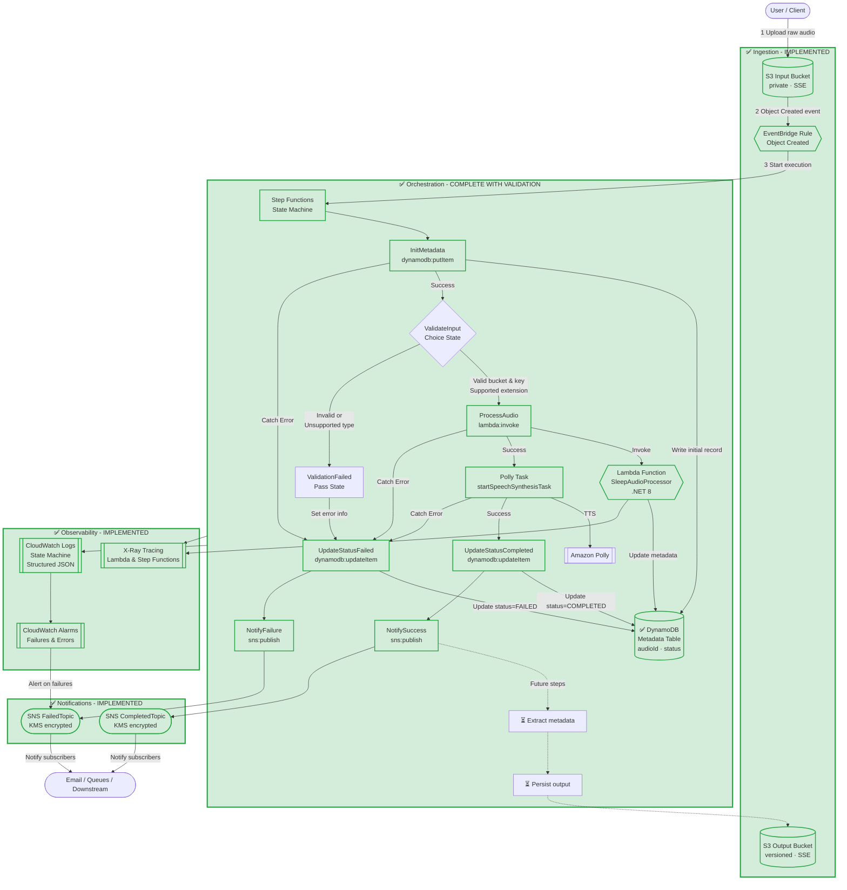
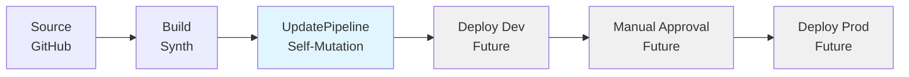

# Architecture — Event-Driven Sleep Audio Pipeline

> **Status:** ✅ **COMPLETE** — End-to-End Validation & Documentation Polish  
> (TDD-driven). The complete foundational pipeline is fully implemented, tested, and documented.
> All core functionality from Issues #2-#12 is complete with comprehensive end-to-end validation.
> **98 comprehensive tests** pass (including 6 new end-to-end integration tests). The system includes:
> S3 input/output buckets, EventBridge rule for object creation events, Step Functions state machine
> with input validation and Polly integration, DynamoDB table for metadata with complete I/O handling,
> SNS notifications with comprehensive error handling, Lambda function for full audio processing with
> S3, Polly, and DynamoDB integration, advanced error handling with retry policies, X-Ray tracing,
> CloudWatch Alarms, and production-ready security controls.
>
> **Final Issue #12 (TDD: End-to-End Validation, Documentation Polish & Project Completion)** is now complete,
> implementing **comprehensive end-to-end integration tests**, **polished documentation** (README, SUMMARY),
> and **final validation**. The project is ready for deployment or production use.
>
> This document is the **single source of truth** for the system design. Every
> future issue and pull request must keep the code and this document consistent.
> If an implementation needs to diverge from this design, update this document in
> the same pull request and explain why.

## 0. Implementation Status

### Completed (Issue #3)
- ✅ **Input S3 Bucket** (`SleepAudioInputBucket`)
  - Private, encrypted with S3-managed keys (SSE-S3)
  - Versioning enabled
  - EventBridge notifications enabled for Object Created events
  - Public access blocked
  - TLS enforced
  - Retention policy: RETAIN

- ✅ **Output S3 Bucket** (`SleepAudioOutputBucket`)
  - Private, encrypted with S3-managed keys (SSE-S3)
  - Versioning enabled
  - Public access blocked
  - TLS enforced
  - Retention policy: RETAIN

- ✅ **EventBridge Rule** (`SleepAudioInputRule`)
  - Triggers on `Object Created` events from the Input Bucket
  - Filters events specifically for the input bucket by name
  - Rule is enabled
  - Targets the Step Functions state machine

### Completed (Issue #4)
- ✅ **Step Functions State Machine** (`SleepAudioPipelineStateMachine`)
  - Skeleton workflow with Polly integration
  - CloudWatch Logs enabled (ALL level, execution data included)
  - Least-privilege IAM execution role
  - Polly Task: Uses `startSpeechSynthesisTask` API
  - Placeholder parameters (text, voice, output format)
  - Triggered by EventBridge rule on S3 Object Created events

- ✅ **Polly Integration**
  - State machine includes Polly task state
  - Uses AWS SDK integration (`arn:aws:states:::aws-sdk:polly:startSpeechSynthesisTask`)
  - Placeholder text: "This is a placeholder sleep audio text."
  - Voice: Joanna
  - Output format: MP3
  - IAM permissions: `polly:StartSpeechSynthesisTask`, `polly:GetSpeechSynthesisTask`

- ✅ **Orchestration Layer**
  - EventBridge → Step Functions wiring complete
  - S3 event data passed to state machine as input
  - CloudWatch Logs log group created for state machine execution
  - 7-day log retention

### Completed (Issue #5)
- ✅ **DynamoDB Metadata Table** (`SleepAudioMetadataTable`)
  - Partition key: `audioId` (string, UUID)
  - Billing mode: PAY_PER_REQUEST (on-demand)
  - Encryption: AWS_MANAGED (SSE)
  - Point-in-time recovery: Enabled
  - Removal policy: RETAIN
  - Stores: `audioId`, `inputBucket`, `inputKey`, `status`, `createdAt`

- ✅ **State Machine I/O Handling**
  - InitMetadata state: First state in workflow
  - Uses `dynamodb:putItem` AWS SDK integration
  - Generates UUID for `audioId`
  - Captures S3 event data: bucket name, object key
  - Sets initial status: "PROCESSING"
  - Records creation timestamp
  - Workflow: InitMetadata → ValidateInput (see Issue #8)
  - IAM permissions: State machine role granted `dynamodb:PutItem`

### Completed (Issue #6)
- ✅ **SNS Topics** (`SleepAudioPipelineCompletedTopic`, `SleepAudioPipelineFailedTopic`)
  - Two SNS topics for success and failure notifications
  - Encrypted with KMS (key rotation enabled)
  - Display names: "Sleep Audio Pipeline Completed" and "Sleep Audio Pipeline Failed"
  - Retention policy: RETAIN

- ✅ **Error Handling and Status Updates**
  - Catch blocks on InitMetadata and PollyTask states
  - Error paths route to UpdateStatusFailed state
  - UpdateStatusCompleted state: Updates DynamoDB status to "COMPLETED"
  - UpdateStatusFailed state: Updates DynamoDB status to "FAILED"
  - Both use `dynamodb:updateItem` AWS SDK integration
  - Updates include `updatedAt` timestamp

- ✅ **Notification Layer**
  - NotifySuccess state: Publishes to CompletedTopic on success path
  - NotifyFailure state: Publishes to FailedTopic on error path
  - Uses `sns:publish` AWS SDK integration
  - Messages include audioId for correlation
  - IAM permissions: State machine role granted `sns:Publish`
  - Least-privilege: Only allowed to publish to specific topics

- ✅ **Updated State Machine Flow**
  - InitMetadata → ValidateInput (see Issue #8) → ProcessAudio → PollyTask → UpdateStatusCompleted → NotifySuccess → End
  - Error Catch → UpdateStatusFailed → NotifyFailure → End
  - All states have proper error handling

### Completed (Issue #7)
- ✅ **Lambda Function - Audio Processor** (`SleepAudioProcessorFunction`)
  - Runtime: .NET 8 (`dotnet8`)
  - Handler: `SleepAudioProcessor::SleepAudioProcessor.Function::FunctionHandler`
  - Memory: 512 MB, Timeout: 30 seconds
  - Environment variables: 
    - `TABLE_NAME` (DynamoDB table name)
    - `INPUT_BUCKET_NAME` (Input S3 bucket name) - **Added in Issue #11**
    - `OUTPUT_BUCKET_NAME` (Output S3 bucket name) - **Added in Issue #11**
  - Purpose: Processes audio files from input bucket, generates/enhances sleep audio, and stores results in output bucket
  - Current functionality:
    - Receives input from state machine (metadata from InitMetadata state)
    - Logs the input for debugging with structured JSON logging
    - Extracts audioId, inputBucket, and inputKey from metadata
    - Downloads input file metadata from S3 (file size)
    - Generates sleep audio using Amazon Polly with neural voice (Joanna)
    - Uploads processed audio to Output S3 bucket with metadata
    - Updates DynamoDB record with output location (`outputKey`, `outputBucket`), file sizes, and status (`COMPLETED`)
    - Returns success response with all metadata including input/output locations and file sizes
  - Error handling: Catches exceptions and returns error response with structured logging

- ✅ **Lambda Integration in State Machine**
  - ProcessAudio state: Invokes Lambda function using `lambda:invoke` integration
  - Position: After ValidateInput, before PollyTask
  - Input: Full state machine context including metadata
  - Output: Stored in `$.processorResult`
  - Error handling: Catch block routes errors to UpdateStatusFailed

- ✅ **Lambda IAM Permissions (Least Privilege)** - **Enhanced in Issue #11**
  - Lambda execution role: Managed by CDK (CloudWatch Logs permissions automatic)
  - DynamoDB access: Lambda granted `UpdateItem` permission on MetadataTable via `grantWriteData`
  - S3 read access: Lambda granted `GetObject*`, `GetBucket*`, `List*` permissions on Input bucket - **Issue #11**
  - S3 write access: Lambda granted `PutObject*`, `Abort*`, `DeleteObject*` permissions on Output bucket - **Issue #11**
  - Polly access: Lambda granted `SynthesizeSpeech` permission for speech synthesis - **Issue #11**
  - X-Ray tracing: Lambda granted `PutTraceSegments`, `PutTelemetryRecords` permissions
  - State machine permissions: Granted `lambda:InvokeFunction` on specific Lambda ARN
  - All IAM policies follow least-privilege principle

- ✅ **Updated State Machine Flow**
  - InitMetadata → ValidateInput → **ProcessAudio** → PollyTask → UpdateStatusCompleted → NotifySuccess → End
  - Error Catch on ProcessAudio → UpdateStatusFailed → NotifyFailure → End
  - Lambda integration adds full audio processing between validation and Polly task

### Completed (Issue #8)
- ✅ **Input Validation State** (`ValidateInput`)
  - Type: Choice state for conditional logic
  - Position: After InitMetadata, before ProcessAudio
  - Validates required S3 event fields:
    - Checks presence of `$.detail.bucket.name`
    - Checks presence of `$.detail.object.key`
  - Validates supported file extensions:
    - Accepts: `.mp3`, `.wav`, `.m4a`
    - Rejects all other file types
  - Routing logic:
    - Valid inputs → ProcessAudio (continues normal flow)
    - Invalid inputs → ValidationFailed (error handling)

- ✅ **Validation Failed State** (`ValidationFailed`)
  - Type: Pass state (no-op, just marks error)
  - Sets error information in `$.error`:
    - Error: "ValidationError"
    - Cause: "Invalid input: missing required fields or unsupported file type"
  - Routes to: UpdateStatusFailed (standard error path)
  - Result: DynamoDB status set to "FAILED", SNS notification sent

- ✅ **Complete End-to-End Flow**
  - Success path: S3 Upload → EventBridge → InitMetadata → ValidateInput → ProcessAudio → PollyTask → UpdateStatusCompleted → NotifySuccess
  - Validation failure path: S3 Upload → EventBridge → InitMetadata → ValidateInput → ValidationFailed → UpdateStatusFailed → NotifyFailure
  - Processing error path: (Any state with Catch block) → UpdateStatusFailed → NotifyFailure
  - All paths properly update DynamoDB status and send SNS notifications

- ✅ **Comprehensive Testing**
  - 54 total tests passing (8 new tests for validation + 46 existing)
  - Tests cover: Input validation logic, end-to-end flow, IAM permissions, component wiring
  - Snapshot test verifies complete stack structure
  - All tests follow TDD approach (written before implementation)

- ✅ **Complete Pipeline Wiring Verification**
  - EventBridge → Step Functions: Verified via tests
  - Step Functions → Lambda: Verified via tests
  - Step Functions → DynamoDB: Verified via tests
  - Step Functions → SNS: Verified via tests
  - Step Functions → Polly: Verified via tests
  - All IAM permissions properly scoped and tested
  - CDK synth succeeds with no errors

### Completed (Issue #9)
- ✅ **Comprehensive Testing & Deployment Preparation**
  - 75 unit tests covering all major components and integration points
  - End-to-end flow tests (InitMetadata → ValidateInput → ProcessAudio → PollyTask → UpdateStatus → Notify)
  - Input validation scenario tests (valid/invalid file types)
  - Error path verification tests
  - Multi-environment configuration tests
  - Pipeline construct tests

- ✅ **Multi-Environment Support**
  - Environment-aware stack naming (CdkBaseStack-dev, CdkBaseStack-stage, CdkBaseStack-prod)
  - CDK context parameter support (`-c environment=dev|stage|prod`)
  - Backward-compatible default to "dev" environment
  - Verified cdk synth for dev, stage, and prod

- ✅ **CDK Pipelines Skeleton**
  - PipelineStack construct for continuous deployment
  - Source, Build/Synth, and UpdatePipeline stages configured
  - Placeholder for GitHub source integration
  - Ready for deployment stage additions

### Completed (Issue #10)
- ✅ **Advanced Error Handling & Retry Policies**
  - Retry policies added to all critical state machine tasks:
    - InitMetadata (DynamoDB PutItem): 3 retries for ProvisionedThroughputExceededException, exponential backoff (2x)
    - ProcessAudio (Lambda): 3 retries for Lambda.ServiceException/TooManyRequestsException, exponential backoff (2x)
    - PollyTask: 3 retries for Polly.ServiceException/ThrottlingException, exponential backoff (2x)
    - UpdateStatusCompleted/Failed: 3 retries for DynamoDB throttling, exponential backoff (2x)
  - Specific error type handling in Catch blocks:
    - Lambda.ServiceException, States.TaskFailed for Lambda errors
    - DynamoDB.ProvisionedThroughputExceededException for DynamoDB throttling
    - Polly.ServiceException for Polly errors
    - States.ALL as final catch-all
  - Enhanced error messages in NotifyFailure:
    - Includes full error context using States.JsonToString($.error)
    - Provides error details for debugging and alerting

- ✅ **X-Ray Tracing & Distributed Tracing**
  - Lambda function X-Ray tracing enabled (Mode: Active)
  - Step Functions X-Ray tracing enabled
  - State machine execution role granted X-Ray permissions (PutTraceSegments, PutTelemetryRecords)
  - Enables end-to-end distributed tracing across Lambda and Step Functions

- ✅ **Structured JSON Logging**
  - Lambda function enhanced with structured JSON logging helper
  - All log entries include:
    - Timestamp (ISO 8601)
    - Log level (INFO, ERROR)
    - Message
    - Request ID (AWS request correlation)
    - Function name and version
    - Contextual data (audioId, status, errors)
  - Replaces simple string logging with structured JSON for better CloudWatch Insights queries

- ✅ **CloudWatch Alarms for Observability**
  - State Machine Failure Alarm:
    - Metric: ExecutionsFailed (AWS/States namespace)
    - Threshold: > 1 execution failure in 5 minutes
    - Action: Publishes to FailedTopic SNS
  - Lambda Error Alarm:
    - Metric: Errors (AWS/Lambda namespace)
    - Threshold: > 1 error in 5 minutes
    - Action: Publishes to FailedTopic SNS
  - Both alarms treat missing data as NOT_BREACHING

- ✅ **Comprehensive Testing**
  - 85 total tests passing (10 new tests for Issue #10 + 75 existing)
  - Tests cover:
    - Retry policy configuration on Lambda, Polly, and DynamoDB tasks
    - Specific error type handling (Lambda.ServiceException, States.TaskFailed, DynamoDB errors)
    - X-Ray tracing enablement on Lambda and State Machine
    - CloudWatch Alarm creation and configuration
    - Structured logging presence in Lambda handler
  - All tests follow TDD approach (written before implementation)

### Completed (Issue #11)
- ✅ **Full Audio Processing Implementation**
  - Lambda function now performs real audio processing (not placeholder)
  - Download input file metadata from S3 (file size extraction)
  - Generate sleep audio using Amazon Polly:
    - Neural voice engine for natural sounding speech
    - Voice: Joanna (calm, soothing)
    - Output format: MP3
    - Soothing sleep relaxation script
  - Upload processed audio to Output S3 bucket:
    - Path: `processed/{audioId}/{filename}-sleep-audio.mp3`
    - Content-Type: audio/mpeg
    - Metadata: generated-by, generated-at timestamp
  - Update DynamoDB with complete output information:
    - `outputKey`: S3 key of processed audio
    - `outputBucket`: Output bucket name
    - `outputFileSize`: Size in bytes of generated audio
    - `status`: Updated to "COMPLETED"
    - `processedAt`: Completion timestamp

- ✅ **S3 Integration**
  - Input bucket: Read permissions for Lambda
  - Output bucket: Write permissions for Lambda
  - Graceful error handling for S3 operations
  - Metadata preservation and tagging

- ✅ **Polly Integration**
  - SynthesizeSpeech permission granted to Lambda
  - Neural engine for high-quality voice synthesis
  - MP3 output format for compatibility
  - Stream handling for efficient memory usage

- ✅ **Enhanced DynamoDB Metadata**
  - New fields: `outputKey`, `outputBucket`, `outputFileSize`
  - Status management: PROCESSING → COMPLETED
  - Timestamp tracking: `processedAt`
  - Atomic updates with conditional expressions

- ✅ **Structured Response**
  - Lambda returns comprehensive metadata:
    - Input: bucket, key, file size
    - Output: bucket, key, file size
    - Processing: audioId, status, timestamp
  - Error responses include detailed error information
  - State machine receives structured data for downstream processing

- ✅ **Testing**
  - 7 new tests for Issue #11
  - Total: 92 tests passing (85 original + 7 new)
  - Tests verify:
    - Environment variables (INPUT_BUCKET_NAME, OUTPUT_BUCKET_NAME)
    - S3 read/write permissions
    - Polly permissions
    - Memory and timeout configuration

### Pending
- Amazon Bedrock integration (optional, feature-flagged)
- SNS topic subscriptions (email, SQS, etc.)
- Deployment to AWS environment
- CloudWatch Dashboard (optional enhancement for visualizing metrics)

### Completed (Issue #12) - **FINAL ISSUE**
- ✅ **End-to-End Integration Tests**
  - Complete happy path flow validation test (S3 → EventBridge → Step Functions → Lambda → Polly → DynamoDB → SNS)
  - Error path flow validation test (error handling and notifications)
  - Data flow through pipeline validation test (audioId, metadata, status tracking)
  - IAM permissions configuration test (least-privilege validation)
  - Security controls validation test (encryption, access control)
  - Observability features validation test (logging, tracing, alarms)
  - Total: 6 new comprehensive end-to-end tests

- ✅ **Documentation Polish & Completion**
  - Expanded README.md with:
    * Project overview and architecture summary
    * Getting started guide with prerequisites
    * Development workflow (build, test, publish, synth, deploy)
    * Testing instructions and deployment guide
    * Security, observability, and multi-environment support
    * Useful commands reference
    * Project status and completion checklist
  - Created SUMMARY.md capturing:
    * Complete project overview and what was built
    * Key design decisions with detailed rationale
    * Development timeline (Issues #2-#12)
    * Achievements, metrics, and deployment readiness
    * Future enhancement ideas
    * Lessons learned and challenges overcome
  - Updated ARCHITECTURE.md with final completion status

- ✅ **Final Validation & Quality Assurance**
  - All 98 tests passing (increased from 92, added 6 end-to-end tests)
  - CDK synth successful with complete CloudFormation template
  - CI workflow validated and passing
  - Code cleanup and consistency improvements
  - Security scanning ready
  - Project ready for deployment and production use

**🎯 Project Status: COMPLETE** — All development issues (#2-#12) finished. System is production-ready with comprehensive testing, security, observability, and documentation.


## 1. High-Level Overview

The Sleep Audio Pipeline is a serverless, **event-driven** system on AWS that
turns raw user-supplied audio into soothing, sleep-oriented audio assets.

A user uploads a raw audio file (a voice recording, an ambient capture, or a
short text prompt rendered as audio) to an **input S3 bucket**. The upload event
is detected by **Amazon EventBridge**, which starts an **AWS Step Functions**
state machine. The state machine validates the file, extracts metadata,
optionally generates or enhances audio with **Amazon Polly** (text-to-speech /
soothing narration) and **Amazon Bedrock** (AI-generated sleep sounds or audio
enhancement), writes the result to a **versioned output S3 bucket**, records
metadata in **Amazon DynamoDB**, and publishes a success or failure notification
to **Amazon SNS**.

The design favors managed, pay-per-use services so the pipeline scales to zero
when idle, requires no servers to patch, and isolates each processing step for
clear observability and least-privilege security.

### Design Goals

- **Event-driven & decoupled** — components communicate through events and
  durable storage, not synchronous calls, so each stage can fail and retry
  independently.
- **Serverless-first** — no always-on compute; cost scales with usage.
- **Secure by default** — least-privilege IAM, encryption at rest and in
  transit, private (non-public) buckets.
- **Observable** — structured logs, metrics, and alarms for every stage.
- **Multi-environment** — the same stack deploys to `dev`, `stage`, and `prod`
  via CDK context, with environment-specific naming and settings.
- **Extensible** — new processing steps can be added to the state machine
  without reworking the ingestion or storage layers.

## 2. Data Flow

1. **Upload.** A client uploads a raw object to the **input bucket** under a
   key convention such as `uploads/{user_id}/{upload_id}.{ext}`. Object-level
   metadata (for example `user_id`) travels with the object.
2. **Detect.** S3 emits an **`Object Created`** event to the default event bus.
   An **EventBridge rule** matches the input bucket (optionally filtered by key
   prefix/suffix) and triggers the workflow. EventBridge is used instead of a
   direct S3→Lambda notification so multiple consumers and richer routing can be
   added later without touching the bucket.
3. **Orchestrate.** EventBridge starts the **Step Functions** state machine,
   passing the bucket name and object key. The state machine owns the
   end-to-end processing logic.
   
   **Current Implementation (Issues #4-8 - Complete Pipeline with Input Validation):**
   - **InitMetadata State** — The first state writes an initial metadata record
     to DynamoDB using `dynamodb:putItem`. It generates a UUID for `audioId`,
     captures the S3 event data (bucket name, object key), sets status to
     "PROCESSING", and records the creation timestamp. The result is stored in
     `$.metadata` while preserving the original input for downstream states.
     Error handling: Catch block routes errors to UpdateStatusFailed.
   - **ValidateInput State (Choice)** — **NEW in Issue #8**: Validates S3 event
     input before processing. This is a Choice state that performs the following
     validations:
     - **Required fields check**: Verifies presence of `$.detail.bucket.name` and
       `$.detail.object.key` from the S3 event
     - **File extension check**: Validates file type by checking if the key ends
       with supported extensions (`.mp3`, `.wav`, `.m4a`)
     - **Success path**: If all validations pass, proceeds to ProcessAudio
     - **Failure path**: If any validation fails, routes to ValidationFailed state
   - **ValidationFailed State (Pass)** — **NEW in Issue #8**: A Pass state that
     marks validation failures with error information:
     - Sets `$.error.Error` to "ValidationError"
     - Sets `$.error.Cause` to descriptive message
     - Routes to UpdateStatusFailed for consistent error handling
   - **ProcessAudio State (Lambda)** — **ENHANCED in Issue #11**: Invokes the
     SleepAudioProcessor Lambda function using `lambda:invoke`. This Lambda performs
     full audio processing:
     - Receives the full state machine context including metadata from InitMetadata
     - Extracts audioId, inputBucket, and inputKey from DynamoDB metadata
     - Downloads input file metadata from S3 (retrieves file size)
     - Generates sleep audio using Amazon Polly:
       * Uses neural voice engine (Joanna) for natural sounding speech
       * Synthesizes calming sleep relaxation script
       * Outputs MP3 format audio stream
     - Uploads processed audio to Output S3 bucket:
       * Path: `processed/{audioId}/{filename}-sleep-audio.mp3`
       * Includes metadata tags (generated-by, generated-at)
     - Updates DynamoDB with output information:
       * `outputKey`: S3 key of processed audio
       * `outputBucket`: Output bucket name  
       * `outputFileSize`: Size in bytes
       * `status`: "COMPLETED"
       * `processedAt`: Timestamp
     - Returns success response with comprehensive metadata:
       * Input details (bucket, key, file size)
       * Output details (bucket, key, file size)
       * Processing details (audioId, status, timestamp)
     - Error handling: Exceptions are caught and returned as error responses;
       Catch block routes Lambda errors to UpdateStatusFailed
   - **Polly Task** — The skeleton state machine includes a Polly task that uses
     `startSpeechSynthesisTask` to generate MP3 audio from placeholder text
     ("This is a placeholder sleep audio text.") using the Joanna voice. The
     output is written to the S3 bucket specified in the event data.
     Error handling: Catch block routes errors to UpdateStatusFailed.
   - **UpdateStatusCompleted** — On successful processing, updates the DynamoDB
     record status to "COMPLETED" and sets `updatedAt` timestamp using
     `dynamodb:updateItem`.
   - **UpdateStatusFailed** — On error, updates the DynamoDB record status to
     "FAILED" and sets `updatedAt` timestamp using `dynamodb:updateItem`.
   - **NotifySuccess** — Publishes a success message to the CompletedTopic SNS
     topic with the audioId for correlation.
   - **NotifyFailure** — Publishes a failure message to the FailedTopic SNS
     topic with the audioId for correlation.
   - **CloudWatch Logs** — All state machine execution events are logged to
     CloudWatch Logs with ALL level logging and execution data included.
   
   **Completed Steps (Issue #11):**
   - ✅ **Download input** — Lambda retrieves input file metadata from S3
   - ✅ **Extract metadata** — Lambda gets file size and other S3 metadata
   - ✅ **Generate audio** — Amazon Polly synthesizes soothing sleep audio with neural voice
   - ✅ **Persist output** — Lambda writes processed audio to Output S3 bucket under
     `processed/{audioId}/{filename}-sleep-audio.mp3` with **versioning enabled**
   - ✅ **Update metadata** — Lambda updates DynamoDB with output location, file sizes, and status
   
   **Future Steps (Potential Enhancements):**
   - **Validate** — enhance validation to check content type, file size limits, and additional metadata
   - **Advanced processing** *(conditional)* —
     - **Audio enhancement** — normalize volume, apply filters, mix with background sounds
     - **Amazon Bedrock** — generate custom ambient sleep sounds or enhance audio with AI
      This branch is optional and feature-flagged per environment
4. **Notify.** On completion the state machine publishes to an **SNS topic**:
   a success message to the **CompletedTopic** with the output location, or a
   failure message to the **FailedTopic** with the error information.
   Subscribers (email, queues, downstream services) react as needed.
5. **Observe.** Every Lambda/state transition emits **CloudWatch Logs** and
   metrics; **CloudWatch Alarms** fire on workflow failures and error-rate or
   latency thresholds.

### Status Lifecycle (DynamoDB `status`)

`PROCESSING → COMPLETED`, or `PROCESSING → FAILED`.

**Current Implementation:** 
- Status is set to `PROCESSING` when the InitMetadata state writes the initial record.
- Status is updated to `COMPLETED` when UpdateStatusCompleted executes.
- Status is updated to `FAILED` when UpdateStatusFailed executes (on error path).

### Input Validation Rules (Issue #8)

**Validation performed by ValidateInput Choice state:**

1. **Required Fields Validation**
   - `$.detail.bucket.name` must be present (S3 bucket name from event)
   - `$.detail.object.key` must be present (S3 object key from event)
   - If either field is missing, routes to ValidationFailed → UpdateStatusFailed

2. **File Extension Validation**
   - Supported audio formats: `.mp3`, `.wav`, `.m4a` (case-insensitive)
   - Validation uses `StringMatches` with pattern `*.{extension}` for both lowercase and uppercase
   - Accepts both lowercase (`.mp3`, `.wav`, `.m4a`) and uppercase (`.MP3`, `.WAV`, `.M4A`) extensions
   - If file extension is not in the supported list, routes to ValidationFailed

3. **Validation Failure Handling**
   - ValidationFailed state sets error information:
     - `Error`: "ValidationError"
     - `Cause`: "Invalid input: missing required fields or unsupported file type"
   - Error information is stored in `$.error` path
   - Routes to UpdateStatusFailed for consistent error handling
   - DynamoDB status is set to "FAILED"
   - SNS notification is published to FailedTopic

4. **Validation Success Path**
   - If all validations pass, proceeds to ProcessAudio state
   - Normal processing flow continues: ProcessAudio → PollyTask → UpdateStatusCompleted → NotifySuccess

**Future Enhancements:**
- Additional file size validation
- Content-type validation from S3 metadata
- User authentication and authorization checks
- Rate limiting per user

## 3. Key AWS Services and Rationale

| Service | Role in the pipeline | Why it was chosen |
| --- | --- | --- |
| **Amazon S3 (input)** | Durable landing zone for raw uploads. | Cheap, durable object storage with native event integration; private bucket with SSE. |
| **Amazon S3 (output)** | Stores processed audio with **versioning**. | Versioning preserves history and protects against accidental overwrite/regression of generated assets. |
| **Amazon EventBridge** | Detects uploads and routes them to the workflow. | Decouples producers from consumers, supports content-based filtering, and lets us add consumers without changing the bucket. |
| **AWS Step Functions** | Orchestrates validate → extract → generate → persist → notify. | Preferred over a single Lambda: built-in retries, error handling, branching, and a visual, auditable workflow. Each step stays small and least-privileged. |
| **AWS Lambda** | Implements individual task states (validation, metadata, persistence glue). | Serverless, pay-per-use compute that scales to zero. |
| **Amazon Polly** | Text-to-speech / soothing voice generation. | Managed neural TTS; no model hosting required. |
| **Amazon Bedrock** | Optional AI-generated sleep sounds / audio enhancement. | Access to foundation models without managing infrastructure; feature-flagged to control cost. |
| **Amazon DynamoDB** | Stores per-job metadata and processing status. | Serverless, single-digit-millisecond key-value store that scales with traffic; on-demand capacity avoids idle cost. |
| **Amazon SNS** | Completion and error notifications. | Simple pub/sub fan-out to email, queues, and downstream systems. |
| **Amazon CloudWatch** | Logs, metrics, and alarms. | Native observability for all of the above. |
| **AWS IAM + KMS** | Least-privilege roles and encryption keys. | Enforces security boundaries and encryption at rest. |

## 4. Architecture Diagram

> **Note:** Components with solid lines are implemented. Components with dashed
> lines are pending implementation.



## 5. Error Handling and Notifications

The state machine implements comprehensive error handling and notification mechanisms:

### Error Handling Strategy

- **Catch blocks:** Both `InitMetadata` and `PollyTask` states have Catch blocks that
  capture all errors (`States.ALL`) and route them to the failure path.
- **Error propagation:** When an error is caught, it's stored in `$.error` for debugging
  and is available throughout the failure path.
- **Graceful degradation:** The workflow always completes (either successfully or with
  failure) and never leaves the DynamoDB record in an inconsistent state.

### Status Updates

The workflow maintains accurate status in DynamoDB throughout its lifecycle:

- **PROCESSING:** Set when `InitMetadata` creates the initial record
- **COMPLETED:** Set by `UpdateStatusCompleted` after successful processing
- **FAILED:** Set by `UpdateStatusFailed` when an error occurs

Both update states also set an `updatedAt` timestamp using the state machine's
execution time (`$$.State.EnteredTime`).

### Notification Flow

#### Success Path
1. Processing completes successfully
2. `UpdateStatusCompleted` updates DynamoDB status to "COMPLETED"
3. `NotifySuccess` publishes to `SleepAudioPipelineCompletedTopic`
4. Message includes audioId for correlation
5. Subscribers receive notification (email, SQS, Lambda, etc.)

#### Failure Path
1. An error occurs in `InitMetadata` or `PollyTask`
2. Catch block routes to `UpdateStatusFailed`
3. `UpdateStatusFailed` updates DynamoDB status to "FAILED"
4. `NotifyFailure` publishes to `SleepAudioPipelineFailedTopic`
5. Message includes audioId for correlation
6. Subscribers receive notification for remediation

### SNS Topics

Both topics are encrypted with KMS (key rotation enabled) and follow least-privilege
access patterns:

- **CompletedTopic:** For successful pipeline executions
- **FailedTopic:** For failed pipeline executions

The state machine execution role has `sns:Publish` permission scoped only to these
two specific topics.

## 6. Security

- **Private buckets.** Both S3 buckets block all public access. Access is via
  IAM principals only; TLS is enforced for data in transit.
- **Encryption at rest.** S3 (SSE, KMS where required), DynamoDB, and SNS are
  encrypted at rest. Output-bucket **versioning** guards against accidental
  loss or overwrite.
- **Least-privilege IAM.** Each Lambda/task state receives a narrowly scoped
  role — for example, the validation step gets `s3:GetObject` on the input
  bucket only; the persistence step gets `s3:PutObject` on the output bucket
  only; the metadata step gets scoped DynamoDB write access. No wildcard
  resource ARNs.
- **Scoped invocation.** EventBridge is granted permission only to start the
  specific state machine; Step Functions assumes purpose-built task roles.
- **Secrets & config.** No credentials in code; configuration flows through CDK
  context and environment variables, with sensitive values in SSM/Secrets
  Manager when needed.

## 6. Observability

**Issue #10 Status: ✅ IMPLEMENTED**

- **Structured Logging.** 
  - Lambda functions use structured JSON logging with standard fields (timestamp, level, message, requestId, functionName, functionVersion)
  - All logs include contextual data (audioId, status, errors) for correlation
  - Step Functions execution history with full execution data enabled (ALL level logging)
  - CloudWatch Logs retention: 7 days for state machine logs
  
- **Distributed Tracing (X-Ray).**
  - X-Ray tracing enabled on Lambda function (Mode: Active)
  - X-Ray tracing enabled on Step Functions state machine
  - State machine execution role has X-Ray permissions (PutTraceSegments, PutTelemetryRecords)
  - Enables end-to-end trace correlation across Lambda invocations and state transitions

- **Retry Policies with Exponential Backoff.**
  - All critical tasks have retry policies configured:
    - **InitMetadata (DynamoDB PutItem)**: 3 retries for ProvisionedThroughputExceededException (2s interval, 2x backoff)
    - **ProcessAudio (Lambda)**: 3 retries for Lambda.ServiceException/TooManyRequestsException (2s interval, 2x backoff)
    - **PollyTask**: 3 retries for Polly.ServiceException/ThrottlingException (3s interval, 2x backoff)
    - **UpdateStatusCompleted/Failed**: 3 retries for DynamoDB throttling (2s interval, 2x backoff)
  - Reduces transient failure impact and improves reliability

- **Advanced Error Handling.**
  - Specific error type catching in Catch blocks:
    - Lambda.ServiceException, States.TaskFailed for Lambda errors
    - DynamoDB.ProvisionedThroughputExceededException for DynamoDB throttling
    - Polly.ServiceException for Polly errors
    - States.ALL as final catch-all
  - Enhanced error context in failure notifications:
    - NotifyFailure includes full error details using States.JsonToString($.error)
    - Provides actionable debugging information in SNS notifications

- **CloudWatch Alarms.**
  - **State Machine Failure Alarm**: Triggers on ExecutionsFailed > 1 in 5 minutes
  - **Lambda Error Alarm**: Triggers on Lambda Errors > 1 in 5 minutes
  - Both alarms publish to FailedTopic SNS for immediate alerting
  - Treat missing data as NOT_BREACHING (prevents false alarms during idle periods)

- **Metrics & Future Enhancements.**
  - CloudWatch metrics available for:
    - Step Functions: ExecutionsFailed, ExecutionsSucceeded, ExecutionTime
    - Lambda: Invocations, Errors, Duration, Throttles, ConcurrentExecutions
    - DynamoDB: ConsumedReadCapacityUnits, ConsumedWriteCapacityUnits, UserErrors
  - Future: CloudWatch Dashboard for visualizing key metrics and alarm states
  
- **Traceability.** 
  - `audioId` (UUID) is the primary correlation identifier
  - Propagated through: DynamoDB metadata, Lambda logs, SNS notifications, and state machine output
  - Enables end-to-end tracing from S3 upload to final notification

## 7. Cost Considerations

- **Scale-to-zero.** All compute (Lambda, Step Functions) and DynamoDB
  on-demand capacity cost nothing when idle.
- **Feature-flag expensive paths.** The Bedrock generation/enhancement branch
  is optional and can be disabled per environment (for example off in `dev`) to
  control inference cost.
- **Storage lifecycle.** Lifecycle rules can transition or expire old raw
  uploads and non-current output versions to cheaper storage tiers.
- **Right-sized notifications.** SNS and CloudWatch usage are proportional to
  pipeline volume.

## 8. Multi-Environment Support

The stack is parameterized by a CDK **context** value (for example
`-c environment=dev|stage|prod`). The environment drives:

- **Resource naming/prefixes** to avoid collisions across environments. Stack names
  include the environment name (e.g., `CdkBaseStack-dev`, `CdkBaseStack-prod`).
- **Feature flags** (for example enabling Bedrock only in `stage`/`prod`).
- **Capacity, alarm thresholds, and retention/lifecycle settings**.
- **Removal policies** (more permissive cleanup in `dev`, retain in `prod`).

### Environment Configuration

To deploy to different environments, use the CDK context parameter:

```bash
# Deploy to dev (default if not specified)
cdk deploy

# Deploy to stage
cdk deploy -c environment=stage

# Deploy to prod
cdk deploy -c environment=prod
```

### Implementation Details

- The `Program.cs` entry point reads the `environment` context value (defaults to "dev")
- Stack resources are created with environment-aware naming
- The `CdkBaseStack` constructor accepts an `environmentName` parameter
- Each environment deployment is isolated by stack name

## 9. Deployment Pipeline (CDK Pipelines)

The project includes a **PipelineStack** construct that sets up continuous deployment
using AWS CDK Pipelines. This is a skeleton implementation that can be customized for
your CI/CD needs.

### Pipeline Architecture



### Pipeline Stages

1. **Source Stage**: Pulls code from GitHub repository (configurable)
2. **Build/Synth Stage**: 
   - Builds the Lambda function (.NET 8)
   - Runs unit tests
   - Synthesizes CDK application
3. **UpdatePipeline Stage**: Self-mutating - updates itself if pipeline code changes
4. **Future Deployment Stages**: Placeholders for dev, stage, and prod deployments

### Pipeline Setup

The `PipelineStack` class (`src/CdkBase/PipelineStack.cs`) provides the skeleton:

```csharp
// In your CDK app (separate from the application stack):
var pipelineStack = new PipelineStack(app, "SleepAudioPipelineStack", new StackProps());
```

**Note**: The current implementation is a skeleton with placeholder values:
- GitHub repository: Replace `"OWNER/REPO"` with actual repository
- GitHub authentication: Configure GitHub token in AWS Secrets Manager
- Deployment stages: Currently commented out, add as needed

### Adding Deployment Stages (Future)

To add automated deployments to different environments:

```csharp
// Create application stages
var devStage = new Stage(app, "Dev");
new CdkBaseStack(devStage, "CdkBaseStack", new StackProps(), "dev");
pipeline.AddStage(devStage);

var prodStage = new Stage(app, "Prod");
new CdkBaseStack(prodStage, "CdkBaseStack", new StackProps(), "prod");
pipeline.AddStage(prodStage, new AddStageOpts {
    Pre = new[] { new ManualApprovalStep("PromoteToProd") }
});
```

## 10. Testing Strategy

Following strict TDD principles, the project includes comprehensive test coverage:

### Test Categories

1. **Component Tests**: Individual resource validation (S3, DynamoDB, SNS, Lambda, etc.)
2. **Integration Tests**: Verify component wiring (EventBridge → Step Functions, etc.)
3. **End-to-End Flow Tests**: Complete pipeline flow validation
4. **Error Path Tests**: Validation failure and error handling verification
5. **Multi-Environment Tests**: Environment context and configuration tests
6. **Pipeline Tests**: CI/CD pipeline structure validation

### Test Execution

```bash
# Run all tests
dotnet test src/CdkBase.sln

# Verify CDK synthesis for different environments
npx cdk synth                          # dev (default)
npx cdk synth -c environment=stage     # stage
npx cdk synth -c environment=prod      # prod

# Check for drift
npx cdk diff -c environment=dev
```

### Test Coverage

- **75 unit tests** covering all major components and integration points
- **Snapshot tests** to detect unexpected infrastructure changes
- **State machine definition tests** for complete workflow validation
- **IAM permission tests** ensuring least-privilege access

## 11. Future Extensibility

- **Additional processing steps** (noise reduction, loudness normalization,
  format transcoding) slot into the Step Functions workflow without changing
  ingestion or storage.
- **New consumers** can subscribe to the same EventBridge events or SNS topic
  (analytics, search indexing, moderation) with no producer changes.
- **API layer** (API Gateway + Lambda) can be added in front of the input
  bucket for pre-signed uploads and job status queries backed by DynamoDB.
- **Catalog / search** over generated assets can be built from the DynamoDB
  metadata table.
- **Advanced deployment strategies**: Blue/green deployments, canary releases,
  and automated rollbacks can be added to the pipeline stages.

## 12. Out of Scope (for the initial design)

- Client/mobile applications and authentication of end users.
- Billing/subscription management.
- A public REST/GraphQL API (noted as a future extension above).
- Actual GitHub repository configuration and secrets management for CI/CD.
