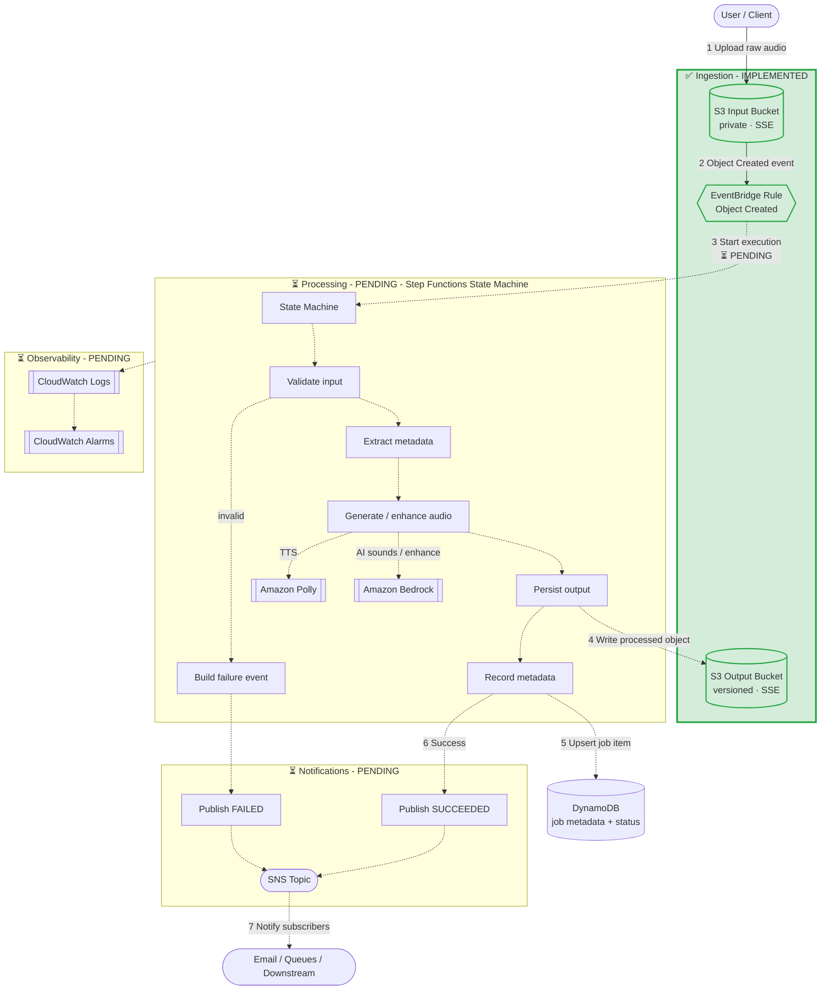

# Architecture — Event-Driven Sleep Audio Pipeline

> **Status:** Partial Implementation (TDD-driven). The foundational infrastructure
> is now implemented: S3 input/output buckets and EventBridge rule for object
> creation events. The next slice is *"[4] TDD: Step Functions State Machine
> Skeleton + Polly Integration"*.
>
> This document is the **single source of truth** for the system design. Every
> future issue and pull request must keep the code and this document consistent.
> If an implementation needs to diverge from this design, update this document in
> the same pull request and explain why.

## 0. Implementation Status

### Completed (Issue #3)
- ✅ **Input S3 Bucket** (`SleepAudioInputBucket`)
  - Private, encrypted with S3-managed keys (SSE-S3)
  - Versioning enabled
  - EventBridge notifications enabled for Object Created events
  - Public access blocked
  - TLS enforced
  - Retention policy: RETAIN

- ✅ **Output S3 Bucket** (`SleepAudioOutputBucket`)
  - Private, encrypted with S3-managed keys (SSE-S3)
  - Versioning enabled
  - Public access blocked
  - TLS enforced
  - Retention policy: RETAIN

- ✅ **EventBridge Rule** (`SleepAudioInputRule`)
  - Triggers on `Object Created` events from the Input Bucket
  - Filters events specifically for the input bucket by name
  - Rule is enabled
  - Target: Not yet configured (placeholder for Step Functions)

### Pending
- Step Functions state machine
- Lambda functions for validation, metadata extraction, persistence
- Amazon Polly integration
- Amazon Bedrock integration (optional, feature-flagged)
- DynamoDB table for job metadata
- SNS topic for notifications
- CloudWatch alarms and observability

## 1. High-Level Overview

The Sleep Audio Pipeline is a serverless, **event-driven** system on AWS that
turns raw user-supplied audio into soothing, sleep-oriented audio assets.

A user uploads a raw audio file (a voice recording, an ambient capture, or a
short text prompt rendered as audio) to an **input S3 bucket**. The upload event
is detected by **Amazon EventBridge**, which starts an **AWS Step Functions**
state machine. The state machine validates the file, extracts metadata,
optionally generates or enhances audio with **Amazon Polly** (text-to-speech /
soothing narration) and **Amazon Bedrock** (AI-generated sleep sounds or audio
enhancement), writes the result to a **versioned output S3 bucket**, records
metadata in **Amazon DynamoDB**, and publishes a success or failure notification
to **Amazon SNS**.

The design favors managed, pay-per-use services so the pipeline scales to zero
when idle, requires no servers to patch, and isolates each processing step for
clear observability and least-privilege security.

### Design Goals

- **Event-driven & decoupled** — components communicate through events and
  durable storage, not synchronous calls, so each stage can fail and retry
  independently.
- **Serverless-first** — no always-on compute; cost scales with usage.
- **Secure by default** — least-privilege IAM, encryption at rest and in
  transit, private (non-public) buckets.
- **Observable** — structured logs, metrics, and alarms for every stage.
- **Multi-environment** — the same stack deploys to `dev`, `stage`, and `prod`
  via CDK context, with environment-specific naming and settings.
- **Extensible** — new processing steps can be added to the state machine
  without reworking the ingestion or storage layers.

## 2. Data Flow

1. **Upload.** A client uploads a raw object to the **input bucket** under a
   key convention such as `uploads/{user_id}/{upload_id}.{ext}`. Object-level
   metadata (for example `user_id`) travels with the object.
2. **Detect.** S3 emits an **`Object Created`** event to the default event bus.
   An **EventBridge rule** matches the input bucket (optionally filtered by key
   prefix/suffix) and triggers the workflow. EventBridge is used instead of a
   direct S3→Lambda notification so multiple consumers and richer routing can be
   added later without touching the bucket.
3. **Orchestrate.** EventBridge starts the **Step Functions** state machine,
   passing the bucket name and object key. The state machine owns the
   end-to-end processing logic:
   - **Validate** — confirm the object exists, the content type/size is within
     limits, and required metadata is present. Invalid inputs short-circuit to
     the failure path.
   - **Extract metadata** — read duration, format, sample rate, and size.
   - **Generate / enhance** *(conditional)* —
     - **Amazon Polly** synthesizes soothing narration from text input.
     - **Amazon Bedrock** generates ambient sleep sounds or enhances the audio.
       This branch is optional and feature-flagged per environment.
   - **Persist output** — write the processed object to the **output bucket**
     under `processed/{user_id}/{upload_id}.{ext}` with **versioning enabled**.
   - **Record metadata** — upsert an item into **DynamoDB** with `user_id`,
     `upload_id`, duration, status, timestamps, and output location.
4. **Notify.** On completion the state machine publishes to an **SNS topic**:
   a `SUCCEEDED` message with the output location, or a `FAILED` message with
   the error cause. Subscribers (email, queues, downstream services) react as
   needed.
5. **Observe.** Every Lambda/state transition emits **CloudWatch Logs** and
   metrics; **CloudWatch Alarms** fire on workflow failures and error-rate or
   latency thresholds.

### Status Lifecycle (DynamoDB `status`)

`RECEIVED → VALIDATING → PROCESSING → SUCCEEDED`, or any stage → `FAILED`.

## 3. Key AWS Services and Rationale

| Service | Role in the pipeline | Why it was chosen |
| --- | --- | --- |
| **Amazon S3 (input)** | Durable landing zone for raw uploads. | Cheap, durable object storage with native event integration; private bucket with SSE. |
| **Amazon S3 (output)** | Stores processed audio with **versioning**. | Versioning preserves history and protects against accidental overwrite/regression of generated assets. |
| **Amazon EventBridge** | Detects uploads and routes them to the workflow. | Decouples producers from consumers, supports content-based filtering, and lets us add consumers without changing the bucket. |
| **AWS Step Functions** | Orchestrates validate → extract → generate → persist → notify. | Preferred over a single Lambda: built-in retries, error handling, branching, and a visual, auditable workflow. Each step stays small and least-privileged. |
| **AWS Lambda** | Implements individual task states (validation, metadata, persistence glue). | Serverless, pay-per-use compute that scales to zero. |
| **Amazon Polly** | Text-to-speech / soothing voice generation. | Managed neural TTS; no model hosting required. |
| **Amazon Bedrock** | Optional AI-generated sleep sounds / audio enhancement. | Access to foundation models without managing infrastructure; feature-flagged to control cost. |
| **Amazon DynamoDB** | Stores per-job metadata and processing status. | Serverless, single-digit-millisecond key-value store that scales with traffic; on-demand capacity avoids idle cost. |
| **Amazon SNS** | Completion and error notifications. | Simple pub/sub fan-out to email, queues, and downstream systems. |
| **Amazon CloudWatch** | Logs, metrics, and alarms. | Native observability for all of the above. |
| **AWS IAM + KMS** | Least-privilege roles and encryption keys. | Enforces security boundaries and encryption at rest. |

## 4. Architecture Diagram

> **Note:** Components with solid lines are implemented. Components with dashed
> lines are pending implementation.

## 5. Security

- **Private buckets.** Both S3 buckets block all public access. Access is via
  IAM principals only; TLS is enforced for data in transit.
- **Encryption at rest.** S3 (SSE, KMS where required), DynamoDB, and SNS are
  encrypted at rest. Output-bucket **versioning** guards against accidental
  loss or overwrite.
- **Least-privilege IAM.** Each Lambda/task state receives a narrowly scoped
  role — for example, the validation step gets `s3:GetObject` on the input
  bucket only; the persistence step gets `s3:PutObject` on the output bucket
  only; the metadata step gets scoped DynamoDB write access. No wildcard
  resource ARNs.
- **Scoped invocation.** EventBridge is granted permission only to start the
  specific state machine; Step Functions assumes purpose-built task roles.
- **Secrets & config.** No credentials in code; configuration flows through CDK
  context and environment variables, with sensitive values in SSM/Secrets
  Manager when needed.

## 6. Observability

- **Logging.** Step Functions execution history plus structured CloudWatch Logs
  from every task state, correlated by `upload_id`.
- **Metrics & alarms.** CloudWatch alarms on Step Functions `ExecutionsFailed`,
  Lambda error rate and duration, and DynamoDB throttling. Alarms notify the
  SNS topic (or a dedicated ops topic) so failures are actionable.
- **Traceability.** `user_id` and `upload_id` are propagated through events,
  logs, DynamoDB items, and notifications for end-to-end tracing.

## 7. Cost Considerations

- **Scale-to-zero.** All compute (Lambda, Step Functions) and DynamoDB
  on-demand capacity cost nothing when idle.
- **Feature-flag expensive paths.** The Bedrock generation/enhancement branch
  is optional and can be disabled per environment (for example off in `dev`) to
  control inference cost.
- **Storage lifecycle.** Lifecycle rules can transition or expire old raw
  uploads and non-current output versions to cheaper storage tiers.
- **Right-sized notifications.** SNS and CloudWatch usage are proportional to
  pipeline volume.

## 8. Multi-Environment Support

The stack is parameterized by a CDK **context** value (for example
`-c env=dev|stage|prod`). The environment drives:

- Resource naming/prefixes to avoid collisions across environments.
- Feature flags (for example enabling Bedrock only in `stage`/`prod`).
- Capacity, alarm thresholds, and retention/lifecycle settings.
- Removal policies (more permissive cleanup in `dev`, retain in `prod`).

## 9. Future Extensibility

- **Additional processing steps** (noise reduction, loudness normalization,
  format transcoding) slot into the Step Functions workflow without changing
  ingestion or storage.
- **New consumers** can subscribe to the same EventBridge events or SNS topic
  (analytics, search indexing, moderation) with no producer changes.
- **API layer** (API Gateway + Lambda) can be added in front of the input
  bucket for pre-signed uploads and job status queries backed by DynamoDB.
- **Catalog / search** over generated assets can be built from the DynamoDB
  metadata table.

## 10. Out of Scope (for the initial design)

- Client/mobile applications and authentication of end users.
- Billing/subscription management.
- A public REST/GraphQL API (noted as a future extension above).
